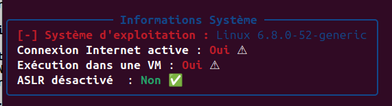
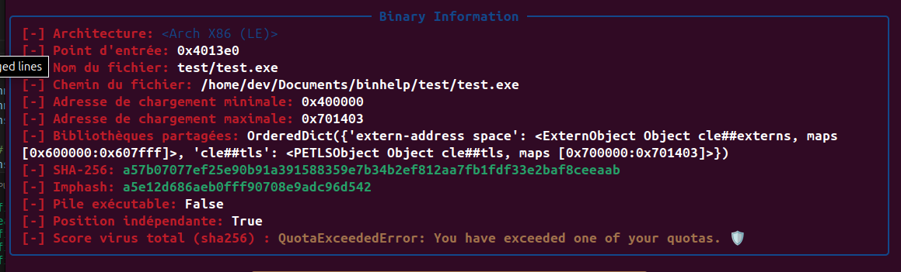
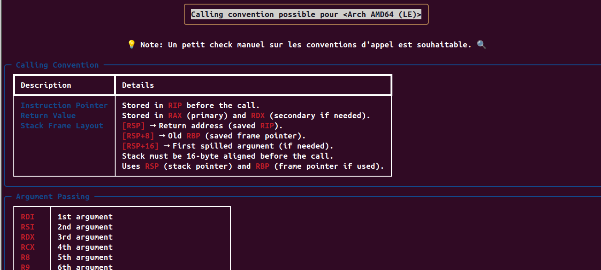
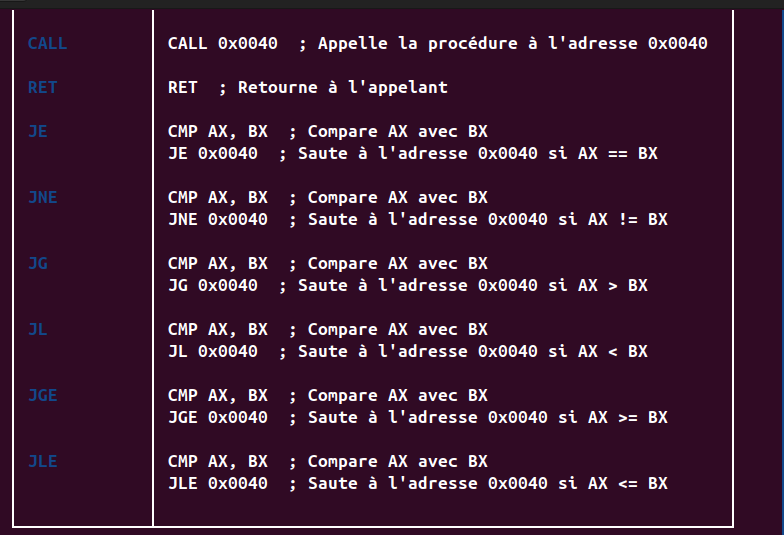
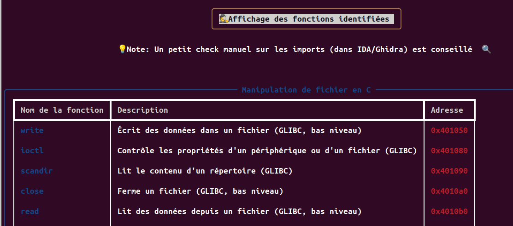
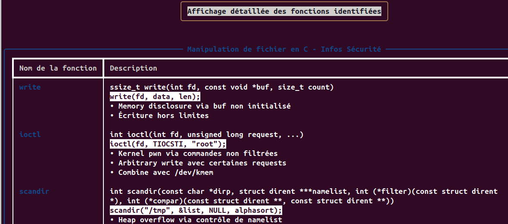
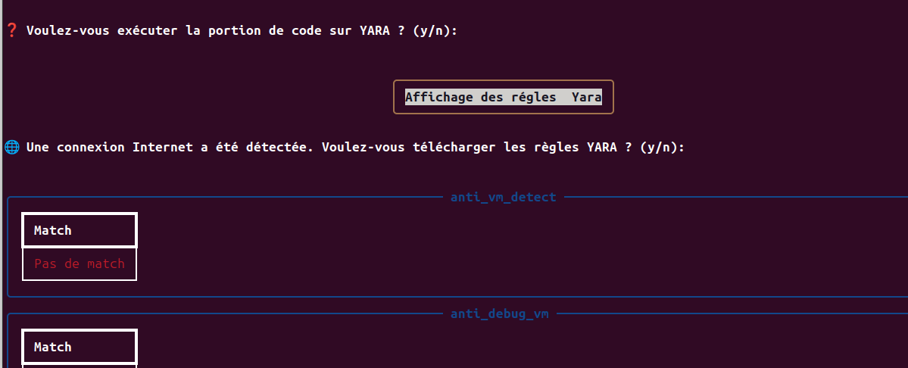
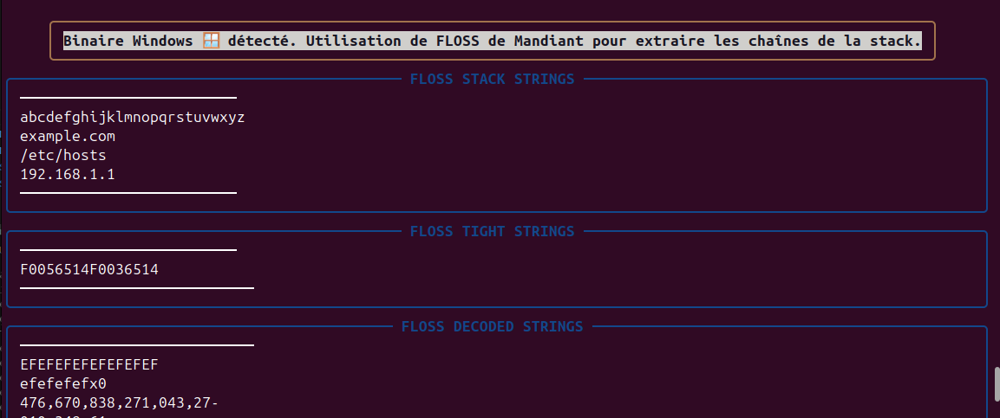
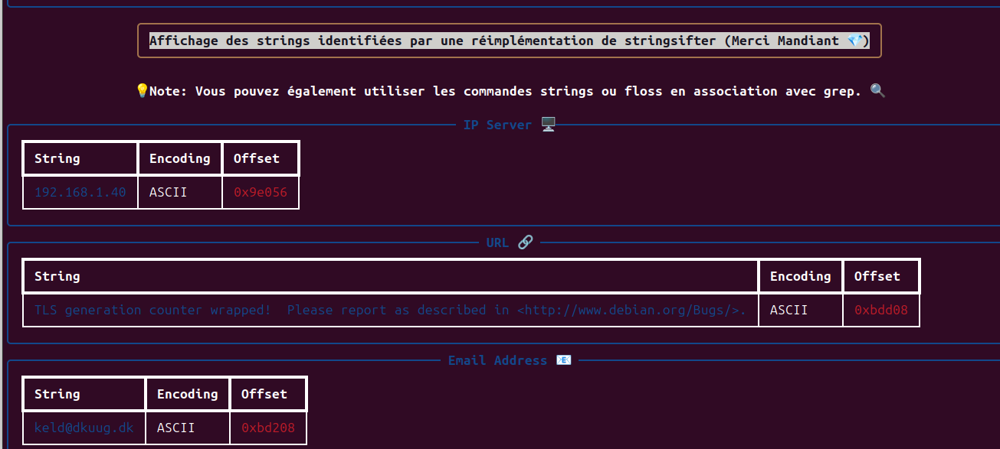
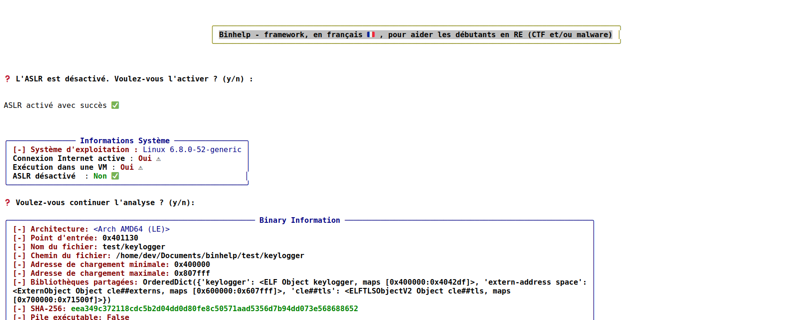

# BinHelp README 📚

## ⚠️ Avertissement

⚠️ **Avertissement :** Ce script est destiné à être utilisé uniquement dans le cadre de CTF ou à des fins d'analyse de malware. N'utilisez pas ce script sur des binaires pour lesquels vous n'avez pas l'autorisation explicite de les analyser. Il est fortement recommandé d'analyser les binaires dans une machine virtuelle ou, au minimum, dans un conteneur Docker.

## Installation 🛠️

Pour installer ce projet, suivez les étapes ci-dessous :

1. Assurez-vous d'avoir Python 3.12 installé sur votre machine.
2. Créez un environnement virtuel Python :
   ```bash
   python3.12 -m venv .env
   ```
3. Activez l'environnement virtuel :
   ```bash
   source .env/bin/activate
   ```
4. Installez les dépendances nécessaires avec pip :
   ```bash
   pip3 install -r requirements.txt
   ```

## Utilisation

```bash
python3 binhelp.py  /path/to/your/binary

Usage: binhelp.py [OPTIONS] BINARY

Options:
  -f, --full          Exécuter toutes les analyses.
  -y, --yara          Exécuter uniquement l'analyse YARA.
  -c, --calling TEXT  Exécuter l'analyse des conventions d'appel et des
                      instructions pour une architecture donnée.
  -s, --strings       Exécuter toutes les analyses liées aux chaînes.
  --help              Show this message and exit.
```

Ce projet a été testé sur un environnement Linux Ubuntu 24.04 en VM et sur des binaires X86_32 et AMD64. Notez que je n'ai pas effectué de revue de code approfondie, il est donc possible qu'il y ait des erreurs ou des incorrections dans les descriptions retournées.

## Fonctionnement Global 🌐

Ce script est conçu pour apporter, rapidement, les éléments nécessaires à l'analyse d'un binaire :

- Effectue quelques vérifications et permet de désactiver l'ASLR si nécessaire :
ex:



- Permet également de retourner le score virus total (en beta) pour ajouter la clé API voir le paragraphe virus total :



- Reconnaitre et afficher les conventions d'appels : 
ex:



- Affiche les principales instructions en fonction de l'architecture :



- Reconnaitre et afficher les descriptions des fonctions utilisées :
ex:



- Permet d'afficher les prototypes des fonctions avec quelques conseils (ça permet d'éviter de chercher dans la documentation à chaque fois ) :
ex:



- Permet d'appliquer les régles Yara de votre choix (voir le paragraphe sur les régles Yara) :
ex:



- Utilise Floss (mandiant) sur les PE afin d'extraire les stack strings :



- Permet de trier les strings du binaires avec l'utilisation et la réimplémentation de l'outil stringsifter de mandiant :
ex:



- Sauvegarde tous les résultat à la racine du projet dans un fichier html 'binhelp_export.html' :
ex:



## Ajouter Vos Propres Règles YARA 📝

Pour ajouter vos propres règles YARA, vous devez modifier le fichier `packages/parser_config.py`. Assurez-vous d'utiliser le format d'URL avec le raw. Voici un exemple :
```python
# parser_config.py
yara_rules = [
    "https://raw.githubusercontent.com/YOUR_REPO/YOUR_RULES_FILE.yar"
]
```
## Virus total

- Pour virus total, vous devez renseigner votre clé api dans un fichier **config.json** que vous créerez à la racine :

```
{
    "vt-api": "YOUR API KEY"
}
```

## License 📜

Ce projet utilise les licences des dépôts suivants :

- [stringsifter]((https://github.com/mandiant/stringsifter))
- [flare-floss]((https://github.com/mandiant/flare-floss))

---

Tagarzh 
